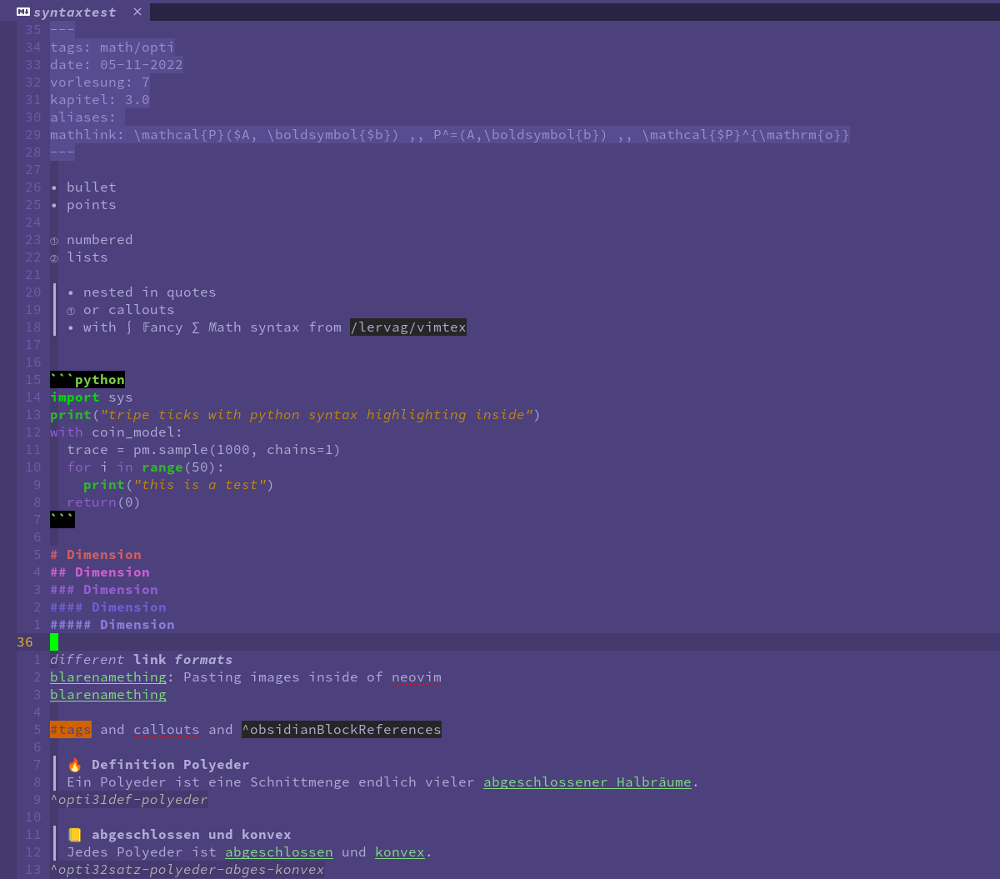
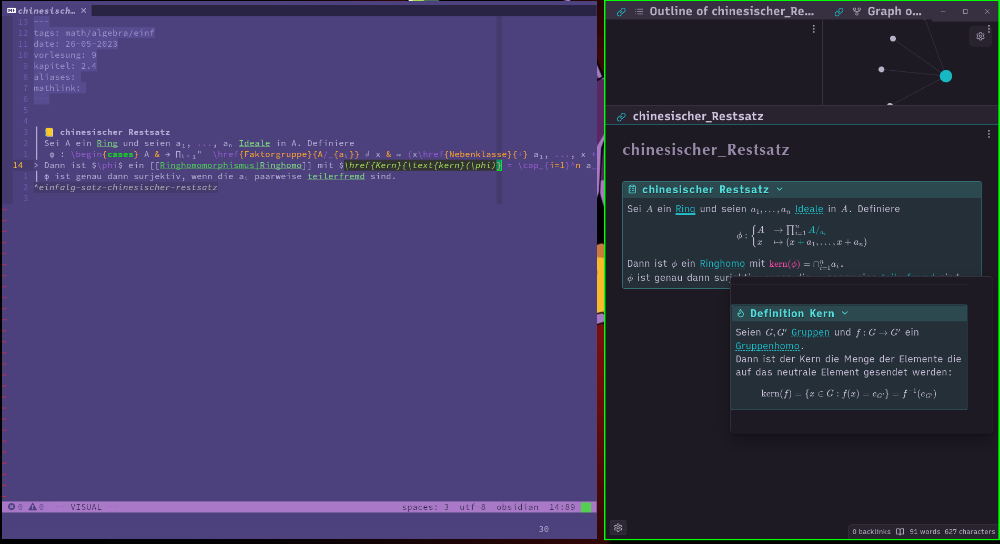

This is a repo containing some stuff that I use when writing my obsidian vault in neovim.
It contains
1. An obsidian syntax file for neovim
2. Telescope plugin for creating links to files/heading/text blocks
3. Telescope plugin to create links inside Mathjax inline or blocks!
4. Telescope picker for files

This setup uses the following plugins:
1. [workspaces.nvim](https://github.com/natecraddock/workspaces.nvim): activate obsidian stuff when entering wiki workspace
2. [telescope.nvim](https://github.com/nvim-telescope/telescope.nvim): picker for creating links to files/heading/text blocks (also works inside math), picker for opening files
3. [hologram.nvim](https://github.com/edluffy/hologram.nvim): Previewing files inside of neovim & kitty
4. [clipboard-image.nvim](https://github.com/ekickx/clipboard-image.nvim): Pasting images inside of neovim
5. [Which-key.nvim](https://github.com/folke/which-key.nvim): Creating bindings
6. [LuaSnip](https://github.com/L3MON4D3/LuaSnip): for creating links inside math blocks
7. [vimtex](https://github.com/lervag/vimtex): for fancy math syntax

# Syntax & color theme

# Math links

This setup includes a Telescope picker that creates mathlinks in obsidian using luasnip.
At the beginning of each file there is a metadata `mathlink` tag where possible "math aliases" are stored.
When using the telescope picker the mathlink gets input as a luasnip snippet.

`mathlink` metadata:

actual mathlink with preview:
The code that is used to generate the math link is highlighted on the left, the output in obsidian is on the right.

Note: In order to use the math links in obsidian see .

# Todo
+ add more obsidian syntax
